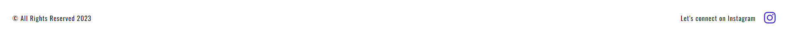

#  Artist's Website - Project 1

Website presents artwork of North Carolina's local artist Chris McCullen. Visitors will find examples of his artwork including drawings, paintings and metal work as well as will be able to learn more about the artist himself and if they wish they contact him directly via contact form. More artwork including music pieces will be added at later stage of website development.

This project is for education and training purposes and can not be used as a template for business use. The goal for this project is to build a responsive website using HTML and CSS with minimal toutches of JavaScript. FlexBox and CSS Grid were used to make website responsive. Photo and artwork copywrites belong to Chris McCullen, the artist.

## [View life website in GitHub Pages](https://gentle-programmer.github.io/Artists-Website/index.html)

# User Goals

The main purpose of this website is to showcase the artist's artwork and for end users to be able to enjoy it for aestetic and therapeutical reasons. The secondary goal for the artist is to invite collaboration opportunities from local art shows, galleries as well as to connect with people interested in his art.

# Technologies

### HTML5

- As a structure language.

### CSS

- As a style language.

### JavaScript

- As a script to give functionality for year in the footer.

### Font Awesome

- As an icon library for a social link.

### Google fonts

- As a font resource.

### GitHub

- As a software hosting platform to keep project in a remote location.

### Git

- As a version-control system tracking.

### GitPod

- As a development hosting platform.

#  Features

This website consists of 4 pages accessible from the navigation menu. The current page is indicated by color change and an underline.
These are the website features:

## Navigation bar

Main navigation bar consists of links to Home, Artwork, Artist and Contact pages. Active page is indicated.

## Footer

Footer is available on every page and consists of copyrights section and a link to social media.

## Home page

Home page consists of a hero image section, a small gallery carusel to shocase some of the art and provide a link to more artwork via button as well as snippets of About the Artist and Let's Connect with buttons to quickly access both pages. 

## Artwork

This page consists of a gallery view of all recent artwork.

## Artist

This page consists of bio section with content provided by the artist himself.

## Contact

Contact page includes the contact form and a thank you (submition page).

## Future Left to Implement

At later stage a page showcasing examples of artist's music will be added.

#  Testing

## Functionality testing

I used Mozilla web developer tools and Chrome developer tools throughout the project for testing and solving problems with responsiveness and style issues.

## Compatibility testing

Site was tested across multiple virtual mobile devices and browsers. I checked all supported devices in both Mozilla web developer tolls and Chrome developer tools.

I tested on hardware devices such as: 14' screen HP laptop, 17' screen Asus laptop, 27' hp monitor, Samsung s20fe, Samsung s7edge and Samsung Note 10.

## Issues found

The app is clear from bugs/ no bugs were found on testing.

## Code Validation

At the and of the project I used two websites to validate a code

- HTML: [W3C validator](https://validator.w3.org/) to validate HTML with no ERROR results

- CSS: [(Jigsaw) validator](https://jigsaw.w3.org/css-validator/) to validate CSS with no ERROR results. 

## Unfixed Bugs

No unfixed bugs were found.

#  Deployment

The project was deployed on GitHub Pages. I used GitPod as a development environment where I commited all changes to git version control system.
I used push command in GitPod to save changes into GitHub.

## [View life website in GitHub Pages](https://gentle-programmer.github.io/Artists-Website/index.html)

#  Credits

Ideas and knowledge library:

  - [w3schools.com](https://www.w3schools.com)

  - [css-tricks.com](https://css-tricks.com/)

  - [developer.mozilla.org/](https://developer.mozilla.org/)

## Content

About Artist text was written by the artist himself.

Website layout inspired by: [Milkovi](https://milkovi.com/), [SophieKahn](https://www.sophiekahn.net/), [maeganguerette](https://www.maeganguerette.com/home)

## Media

All photos used on the website were provided by the artist himself.

## Tools 

Photo converter: [ezgif](https://ezgif.com/) and [Convertio](https://convertio.co/)
Compress photos: [Compress-online](https://compress-online.com/pl/compress-webp), [Aspose](https://products.aspose.app/imaging/pl/image-compress/webp) 

## Code

Grid design tool used: [CSSGRID-Generator](https://cssgrid-generator.netlify.app/)
Button design used from: [Copy-Paste-CSS](https://copy-paste-css.com/)
Contact From: [Domanart.pl]http://domanart.pl/formularz-kontaktowy/
Fonts & icons used: [Fontawesome](https://fontawesome.com/) and [Google Fonts](https://fonts.google.com/)
Gallery design: [FreeFrontEnd](https://freefrontend.com/css-gallery//)
Gellery Carusel on Home Page: [AurainWeb](https://www.aurainweb.pl/przykladowe-realizacje-karuzel-css-js/)
